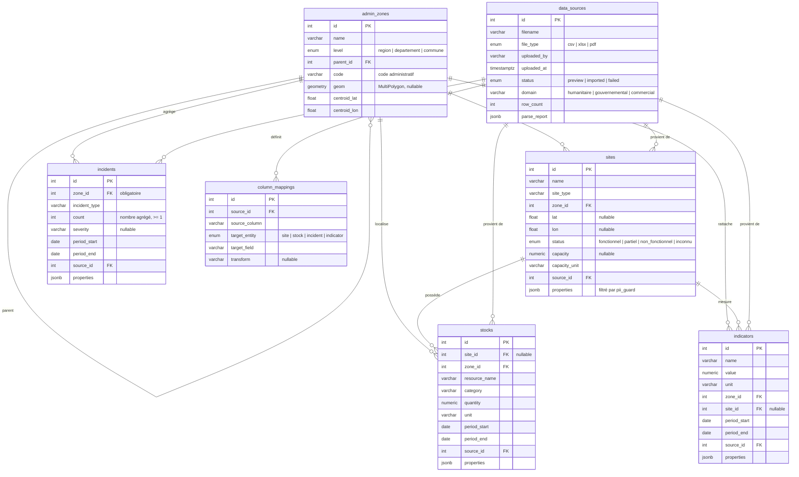

# Architecture — Plateforme d'intégration de données (Niger)

> **Statut : proposition soumise à validation.** Aucun code applicatif n'est écrit tant que ce document n'est pas validé.

Plateforme d'intégration et d'analyse de données inspirée de Palantir Foundry, adaptée au Niger et à l'Afrique de l'Ouest. Un même noyau technique sert trois audiences (ONG/humanitaire, administrations, PME) avec trois jeux de données de démonstration.

**Contrainte de conception fondamentale : données agrégées et d'infrastructures uniquement.** Le modèle de données ne peut ni stocker ni relier des personnes physiques identifiables. Voir la section [Garde-fous anti-PII](#garde-fous-anti-pii).

---

## 1. Vue d'ensemble

```
┌─────────────────────────────────────────────────────────────────┐
│  Frontend — React + Vite + Tailwind                             │
│  Import │ Carte (Leaflet) │ Dashboards (Recharts) │ Question    │
└───────────────────────────┬─────────────────────────────────────┘
                            │ REST (JSON)
┌───────────────────────────┴─────────────────────────────────────┐
│  Backend — FastAPI                                              │
│  ┌───────────┐ ┌───────────┐ ┌────────────┐ ┌───────────────┐  │
│  │ Ingestion │ │ Ontologie │ │ Requêtes / │ │ RAG           │  │
│  │ CSV/XLSX/ │ │ mapping + │ │ agrégation │ │ (abstraction  │  │
│  │ PDF       │ │ pii_guard │ │            │ │  LLM)         │  │
│  └─────┬─────┘ └─────┬─────┘ └─────┬──────┘ └──────┬────────┘  │
└────────┼─────────────┼─────────────┼───────────────┼───────────┘
         └─────────────┴──────┬──────┴───────────────┘
                    ┌─────────┴──────────┐
                    │ PostgreSQL+PostGIS │
                    └────────────────────┘
```

### Structure du dépôt

```
backend/
  app/
    main.py               # point d'entrée FastAPI
    core/                 # config, session BD
    models/               # modèles SQLAlchemy (ontologie)
    schemas/              # schémas Pydantic (API)
    api/                  # routeurs : uploads, zones, objets, dashboard, ask
    services/
      parsing.py          # CSV / XLSX (openpyxl) / PDF (pdfplumber)
      ingestion.py        # préview → mapping → import
      pii_guard.py        # garde-fou anti-données personnelles
      zone_matcher.py     # rattachement aux zones administratives
      aggregation.py      # requêtes d'agrégation pour dashboards/RAG
    rag/
      provider.py         # interface LLMProvider (abstraite)
      anthropic_provider.py
      mock_provider.py    # dev sans clé API
      nl2query.py         # question → fonctions de requête → réponse FR
  alembic/                # migrations
  tests/
frontend/
  src/
    pages/                # Import, Carte, Dashboards, Question, Sources
    components/           # MapNiger, ChartAuto, MappingEditor, FiltersBar…
    api/                  # client REST (TanStack Query)
scripts/
  seed_zones.py           # zones administratives du Niger + GeoJSON régions
  generate_humanitaire.py # jeu démo 1 (distribution d'aide alimentaire)
  generate_gouv.py        # jeu démo 2 (infrastructures publiques)
  generate_commercial.py  # jeu démo 3 (réseau de points de vente)
docker-compose.yml        # postgres+postgis, backend, frontend
README.md
```

---

## 2. Schéma de base de données

### Diagramme entité-relation



### Choix de modélisation

**Tables typées plutôt qu'un modèle EAV générique.** Les quatre objets métier (`Site`, `Stock`, `Incident`, `Indicateur`) sont des tables SQL distinctes avec colonnes fortement typées, plus un champ `properties JSONB` pour les attributs additionnels non prévus. C'est plus simple à requêter (dashboards, RAG), plus performant, et l'extensibilité reste possible : un attribut récurrent dans `properties` peut être promu en colonne par migration. Un modèle 100 % générique (table `objects` + table `attributes`) serait plus « Palantir » mais coûterait la semaine entière.

**Toute donnée est rattachée à une zone.** `zone_id` est obligatoire sur les quatre objets (pour un stock, dérivé du site s'il y en a un). La hiérarchie région → département → commune est une table auto-référencée `admin_zones`, pré-remplie par script avec les 8 régions du Niger (Agadez, Diffa, Dosso, Maradi, Niamey, Tahoua, Tillabéri, Zinder), leurs départements, et les communes utilisées par les jeux de démo. Les géométries (GeoJSON simplifié embarqué dans le dépôt) permettent les choroplèthes ; les agrégations remontent la hiérarchie (une requête « à Tillabéri » somme les communes de la région).

**Les incidents n'ont pas de coordonnées.** C'est volontaire et structurel : la table `incidents` ne comporte ni `lat/lon` ni référence à un site précis — uniquement `zone_id`, un type, un comptage (`count ≥ 1`, contrainte CHECK) et une période. Un incident est toujours une fréquence par zone, jamais un événement individuel géolocalisé.

**Traçabilité.** Chaque ligne importée référence `data_sources` (fichier, date, uploader, rapport de parsing). Les mappings de colonnes sont persistés (`column_mappings`) pour être rejouables sur un fichier de même structure.

### Garde-fous anti-PII

La contrainte « aucune personne identifiable » est appliquée à trois niveaux :

1. **Par le schéma** : aucune table ni champ ne peut représenter une personne (pas de table `persons`, pas de champs nom/prénom/contact ; les bénéficiaires n'existent que comme valeurs numériques agrégées dans `indicators`, ex. `beneficiaires_total = 1250` pour une commune).
2. **À l'ingestion** (`pii_guard.py`) : détection sur les noms de colonnes (liste noire FR/EN : nom, prénom, téléphone, NIN, CNI, email, date de naissance…) et heuristiques sur le contenu (formats téléphone, motifs d'identifiants personnels). Une colonne suspecte **bloque le mapping** avec un message en français expliquant le refus et proposant l'alternative agrégée (ex. « comptez les bénéficiaires par commune plutôt que de les lister »). Elle ne peut pas non plus transiter par `properties` : les clés JSONB sont filtrées par la même liste noire avant insertion.
3. **Au RAG** : le LLM ne génère jamais de SQL libre — il ne peut appeler que des fonctions de requête agrégées (voir § 4), donc aucune donnée fine ne peut être exfiltrée par une question.

---

## 3. Flux d'ingestion

```
1. POST /api/uploads              → fichier stocké, parsé (pandas / openpyxl / pdfplumber)
2. GET  /api/uploads/{id}/preview → colonnes, types inférés, 20 premières lignes,
                                    alertes PII éventuelles, suggestions de mapping
3. POST /api/uploads/{id}/mapping → l'utilisateur mappe colonnes → objet métier + champs
                                    (validation pii_guard ici : refus si colonne interdite)
4. POST /api/uploads/{id}/import  → rattachement aux zones (zone_matcher : normalisation
                                    + correspondance floue sur admin_zones), insertion,
                                    rapport d'import (lignes acceptées / rejetées + motifs)
```

Le `zone_matcher` normalise les noms (accents, casse, variantes « Tillabéri/Tillaberi ») et fait une correspondance floue contre `admin_zones` ; les lignes sans zone reconnue sont rejetées avec motif dans le rapport, jamais insérées silencieusement.

---

## 4. RAG — interrogation en langage naturel

**Principe : le LLM planifie, le backend exécute.** Pas de génération SQL libre.

```
Question FR ─→ LLM (+ schéma d'ontologie, zones et indicateurs disponibles)
           ─→ appels de fonctions de requête restreintes :
                count_sites(site_type, status, zone, level)
                indicator_series(name, zone, period_start, period_end)
                stock_summary(resource, zone|site, period)
                incidents_summary(incident_type, zone, period)
           ─→ exécution SQL paramétrée côté backend (services/aggregation.py)
           ─→ LLM formule la réponse en français avec les chiffres retournés
```

Avantages : pas d'injection SQL, périmètre agrégé garanti par construction, et les mêmes fonctions d'agrégation servent aux dashboards. L'abstraction `LLMProvider` (interface `complete(messages, tools) → réponse/appels d'outils`) a deux implémentations : `AnthropicProvider` (clé API fournie par vous, via variable d'environnement) et `MockProvider` (réponses canées pour développer et tester sans clé). Chaque question et sa réponse sont journalisées (table légère `rag_queries`) pour la démo et l'audit.

---

## 5. API REST (esquisse)

| Méthode | Route | Rôle |
|---|---|---|
| POST | `/api/uploads` | upload d'un fichier CSV/XLSX/PDF |
| GET | `/api/uploads/{id}/preview` | prévisualisation + alertes PII |
| POST | `/api/uploads/{id}/mapping` | définition du mapping colonnes → ontologie |
| POST | `/api/uploads/{id}/import` | import définitif + rapport |
| GET | `/api/zones` | arbre des zones administratives |
| GET | `/api/zones/geojson?level=region` | géométries pour la carte |
| GET | `/api/sites`, `/api/stocks`, `/api/incidents`, `/api/indicators` | listes filtrables (zone, période, type) |
| GET | `/api/dashboard/summary` | agrégats pour les graphiques auto-générés |
| POST | `/api/ask` | question en langage naturel (RAG) |
| GET | `/api/sources` | traçabilité des imports |

---

## 6. Frontend

Cinq pages, interface entièrement en français :

- **Import** — glisser-déposer, prévisualisation du tableau parsé, éditeur de mapping (sélecteurs objet métier + champ par colonne, alertes PII inline), rapport d'import.
- **Carte** — carte du Niger (Leaflet), choroplèthe par région/département ou markers de sites selon le type d'objet affiché ; filtres zone / période / type ; vue « situational awareness » = choroplèthe de fréquence d'incidents par zone.
- **Tableaux de bord** — graphiques auto-générés (Recharts) selon les données présentes : séries temporelles (indicateurs/stocks dans le temps), barres (comparaison entre zones), répartition (types de sites, statuts).
- **Question** — champ de question, réponse en français avec les chiffres et un rappel des filtres interprétés.
- **Sources** — liste des fichiers importés, statuts, rapports.

---

## 7. Jeux de données de démonstration

Trois générateurs (`scripts/`) produisent des CSV fictifs mais réalistes, avec les vraies zones du Niger, puis les injectent via le pipeline d'ingestion standard (ce qui teste le pipeline lui-même) :

1. **Humanitaire** — sites de distribution par commune (Diffa, Tillabéri, Maradi), stocks de vivres mensuels, bénéficiaires **en nombre agrégé par commune** (indicateur), incidents d'accès par département.
2. **Gouvernemental** — écoles, centres de santé, points d'eau : localisation, état fonctionnel, capacité (les 8 régions).
3. **Commercial** — points de vente, ventes mensuelles par région, stocks et ruptures (indicateur `taux_rupture`).

---

## 8. Plan d'implémentation (1 semaine)

| Jour | Bloc | Point d'étape |
|---|---|---|
| J1 | Squelette (docker-compose, FastAPI, Vite), modèles + migrations, seed des zones | BD en place, `/api/zones` répond |
| J2 | Ingestion CSV/XLSX/PDF + preview + pii_guard | **Point 1 : ingestion** |
| J3 | Mapping ontologie + import + zone_matcher | **Point 2 : ontologie** |
| J4 | Carte Leaflet + filtres + dashboards Recharts | **Point 3 : carte** |
| J5 | RAG (provider, fonctions de requête, page Question) | **Point 4 : RAG** |
| J6 | Générateurs de données démo, parcours complet des 3 scénarios | démo bout en bout |
| J7 | Marge : polish, README, corrections | — |

### Hors périmètre MVP (assumé)

Authentification/multi-utilisateurs (le champ `uploaded_by` est déclaratif), orchestration type Airflow, édition manuelle des objets en base, exports, temps réel. Extensible ensuite sans casser le schéma.
